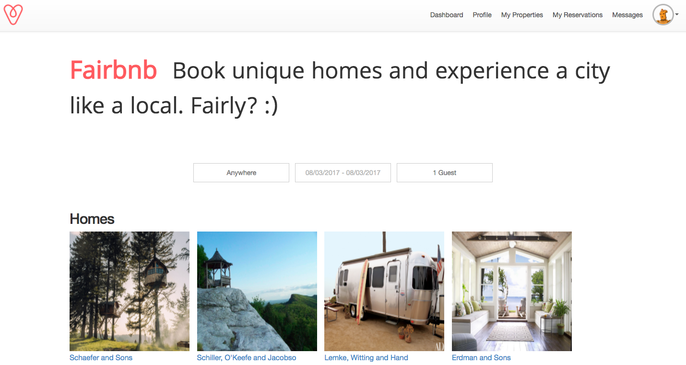
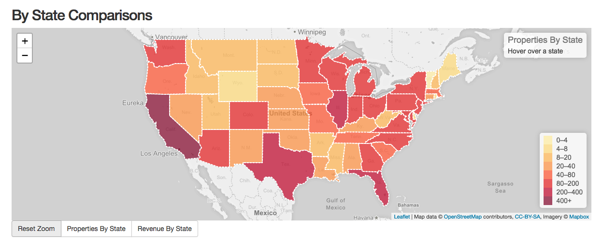
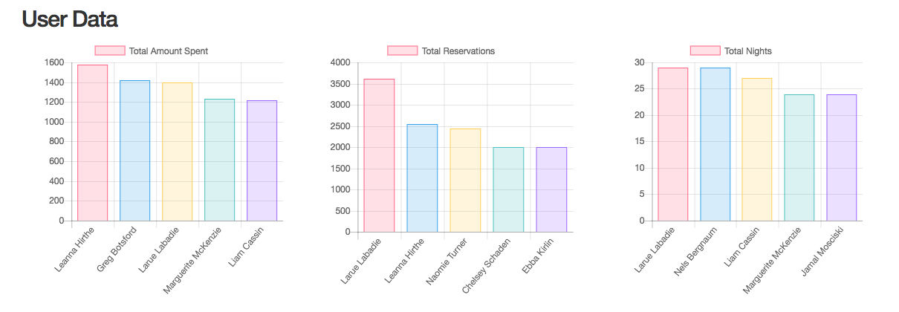
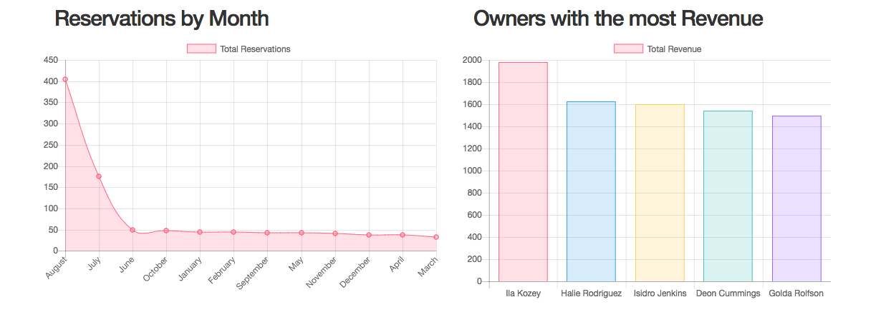

# AirBnB
[](https://travis-ci.org/iamchrissmith/air_bnb_clone)  
Security:
- Hakiri: [](https://hakiri.io/github/iamchrissmith/air_bnb_clone/master)

Production: https://airbnb-me-a-river.herokuapp.com/





This project is a clone of AirBnB that was handed over to our group as a brownfield. New features added include: Property reservations,
an admin dashboard with a graphical representation of the statistics generated by the internal API built by the previous team,
instant messaging between visitors and hosts, Google Maps API integration, and property listing reservations.

## Getting Started

In addition to forking and cloning down the repository. You'll need to obtain the following API keys for full functionality.
Then follow the instructions for installing.

Obtain through Google Oauth
* GOOGLE_CLIENT_ID
* GOOGLE_CLIENT_SECRET

Obtain through Facebook Oauth
* FACEBOOK_KEY:
* FACEBOOK_SECRET:

Obtain through Google API
* GOOGLE_MAP_KEY: (JavaScript specific key)
* GOOGLE_GEO_KEY: (Geocoder that converts addresses to latitude, longitude)

Obtain through Weather Underground. Grabs weather for each property location.
* WEATHER_KEY:

Obtain through New Relic for APM monitoring
* NEW_RELIC_KEY:


### Prerequisites

```
Ruby 2.4.1
Bundler 1.15.2 (At the moment, heroku does not run with the latest version)
```

### Installing

Initial Setup
```
bundle install

bundle exec figaro install
```

This will generate the application.yml file, which you will need to add the keys specified above
for the app to work. Next, load the database and seed.

```
rake db:create
rake db:schema:load
rake db:seed
```


## Running the tests

All tests are currently run with the rspec command.

## Built With

* [Ruby on Rails](http://rubyonrails.org/) - Web Framework
* [Travis CI](https://travis-ci.org/) - Continuous Integration Tool
* [Hakiri](https://hakiri.io/) - Security Monitoring Tool for Rails Apps
* [PostgreSQL](https://www.postgresql.org/) - Open Source Database
* [Redis](https://redis.io/) - Open Source Datastore for Instant Messaging

## Authors

* **Victoria Vasys** - *Initial work First Sprint* - https://github.com/VictoriaVasys
* **Lauren Oliveri** - *Initial work First Sprint* - https://github.com/lao9
* **Beth Knight** - *Initial work First Sprint* - https://github.com/BethKnight1234
* **Colleen Ward** - *Initial work First Sprint* - https://github.com/caward12
* **Erin Bassity** - *Initial work First Sprint* - https://github.com/somedayrainbows

* **Chris Smith** - *Second Sprint* - https://github.com/iamchrissmith
* **Bao Nguyen** - *Second Sprint* - https://github.com/rongxanh88
* **Aaron Olsen** - *Second Sprint* - https://github.com/MrAaronOlsen
* **Rhonda Wilhelmson** - *Second Sprint* - https://github.com/rwilhel

## Acknowledgments

* Thank you Turing Cohort 1701 for giving us this lovely project!

**Internal API**

The following api endpoints are available:

*For users*



`/api/v1/users/money/most_revenue` lists users who have made the most money as property owners based on reservation income. Can take a `limit` param, default is 10 users.

`/api/v1/users/money/most_spent` lists users who have spent the most money on reservations. Can take a `limit` param, default is 10.

`/api/v1/users/properties/most_properties` lists users who have the most properties listed that they are the owner of. Can take a `limit` param, default is 10.

`/api/v1/users/reservations/bookings` lists users who have made the most reservations. Can take a `limit` param, default is 10.

`/api/v1/users/reservations/nights` lists users who have booked the most number of nights. Can take a `limit` param, default is 10.

*For reservations*



`/api/v1/reservations/by_month` lists count of reservations by month. Can take a `city` param, that scopes to reservations by month for that city, default is for all reservations.

`/api/v1/reservations/revenue_by_month` lists the total revenue by month after taking a `city` param that scopes to revenue by month for that city.

`/api/v1/reservations/highest_revenue_cities` lists the top cities by month and year after taking a `month` and `year` param.

`/api/v1/reservations/revenue_by_state` lists the total revenue for each state.
